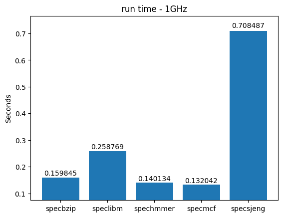
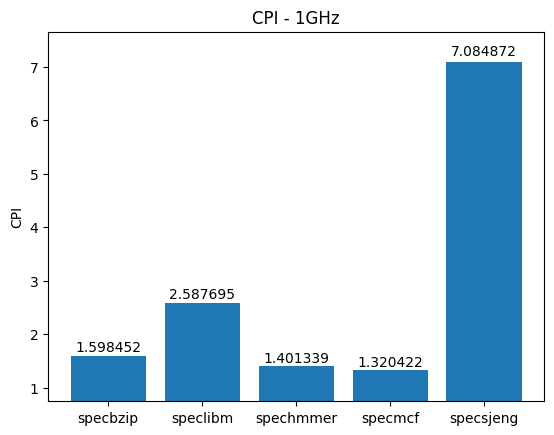
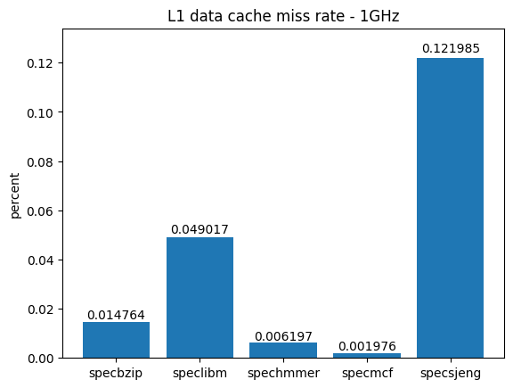
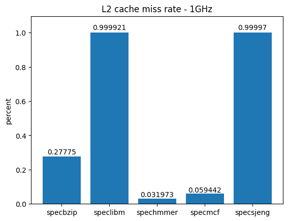
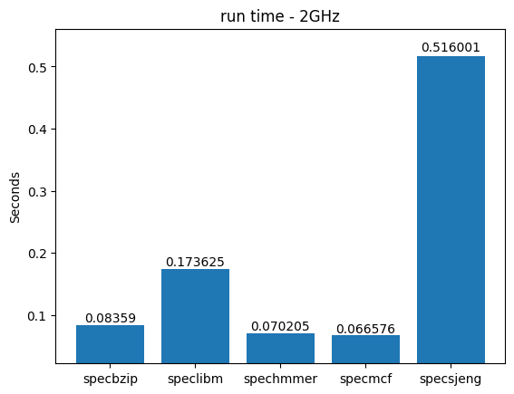
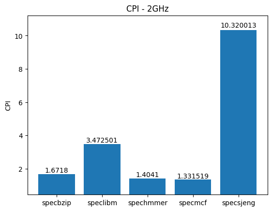
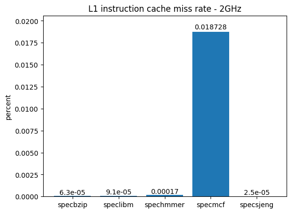
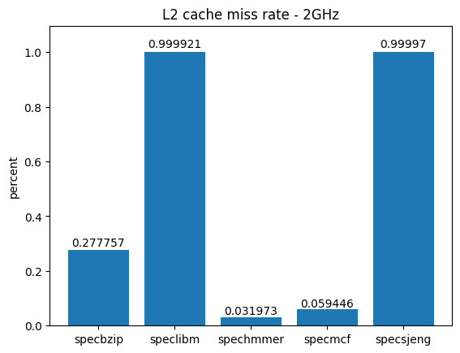

ΑΡΙΣΤΟΤΕΛΕΙΟ ΠΑΝΕΠΙΣΤΗΜΙΟ ΘΕΣΣΑΛΟΝΙΚΗΣ

ΠΟΛΥΤΕΧΝΙΚΗ ΣΧΟΛΗ

ΤΜΗΜΑ ΗΛΕΚΤΡΟΛΟΓΩΝ ΜΗΧΑΝΙΚΩΝ &amp; ΜΗΧΑΝΙΚΩΝ ΥΠΟΛΟΓΙΣΤΩΝ

# Αρχιτεκτονική Προηγμένων Υπολογιστών - 2η Εργαστηριακή Άσκηση

# Βήμα 1
## Απάντηση ερώτησης 1

Ο επεξεργαστής που εξομοιώνει ο gem5 διαθέτει τα ακόλουθα χαρακτηριστικά
όσον αφορά το υποσύστημα μνήμης:

| Cache type     | Size  | Associativity | Line size (bytes) |
|----------------|-------|---------------|-------------------|
| L1 data        | 64 KB | 2-way         | 64                |
| L1 instruction | 32 KB | 2-way         | 64                |
| L2             | 2 MB  | 8-way         | 64                |

## Απάντηση ερώτησης 2

Οι μετρήσεις έγιναν με τις default ρυθμίσεις του MinorCPU, με μόνη μεταβολή
στη συχνότητα του ρολογιού πυρήνα.
Τα αποτελέσματα των benchmarks φαίνονται στα παρακάτω γραφήματα:

 
 
 
 

Ομοίως και για 2 GHz:

 
 
 

Παρατηρούμε ότι στα 2 GHz υπάρχει αισθητή μείωση του χρόνου εκτέλεσης
(47.7% για το `specbzip`, 32.9% για το `speclibm`, 49.9% για `spechmmer`
και ~50% για το `specmcf`), ενώ σε άλλα όπως το `specsjeng` η μείωση 
ανέρχεται μόνο σε 27.16%. Μετά τη μεταβολή της συχνότητας το CPI χειροτερεύει,
με αύξηση 45.66% για το `specsjeng`, 25.48% για το `speclibm` και μόλις 0.83%,
0.19% και 4.38% για τα `specmcf`, `spechmmer` και `specbzip` αντίστοιχα.

Από τα παραπάνω συμπεραίνουμε ότι κάποια benchmarks όπως τα `spechmmer` και
`specmcf` εξαρτώνται ισχυρά από τη συχνότητα ρολογιού όσον αφορά το χρόνο 
εκτέλεσης. Άλλα, όπως το `specsjeng` δεν επωφελούνται στον ίδιο βαθμό από την 
αύξηση του ρολογιού και μάλιστα χειροτερεύουν αρκετά όσον αφορά το CPI, κάτι που
δείχνει σε μια ισχυρότερη εξάρτηση από τη δομή της cache (μέγεθος και associativity)
για την απόδοσή τους, η οποία και στις 2 περιπτώσεις διατηρήθηκε σταθερή. Τέλος, 
υπάρχουν και benchmarks τα οποία επωφελούνται μεν από την αύξηση του ρολογιού, αλλά
ταυτόχρονα αυξάνεται το CPI τους, το οποίο εμφανίζει μια πιθανή εξάρτηση και από τη
δομή της cache, σε μεγαλύτερο ή μικρότερο βαθμό. Τέτοια benchmarks είναι τα `speclibm`
και `specbzip`.

## Απάντηση ερώτησης 3

To `system.clk_domain.clock` ισούται με 1000 ticks και στα δύο συστήματα. Αντίθετα,
αυτό που μεταβάλλεται είναι το `system.cpu.clk_domain.clock`, το οποίο ισούται με
1000 ticks για τον επεξεργαστή στο 1 GHz και με 500 ticks σε αυτόν με 2 GHz. Επομένως,
συμπεραίνουμε ότι το CPU clock domain είναι το ρολόι του πυρήνα του επεξεργαστή, ενώ το
system clock domain είναι υπεύθυνο για τη διατήρηση μιας baseline συχνότητας επικοινωνίας
για όλο το υπόλοιπο σύστημα (πχ. caches εδώ) ούτως ώστε να υπάρχει ένας συγχρονισμός και να
αποφεύγεται το drifting. Αν προσθέσουμε έναν ακόμα επεξεργαστή, αυτός θα έχει CPU clock
ίσο με 2 GHz και θα επικοινωνεί με τον άλλον με τη συχνότητα του system clock, εδώ 1 GHz.

Όπως αναλύθηκε και στην ερώτηση 2, παρατηρούμε ότι δεν υπάρχει τέλειο scaling στο χρόνο
εκτέλεσης για όλα τα benchmarks με το διπλασιασμό της συχνότητας ρολογιού. Αυτό οφείλεται
στο γεγονός ότι το κέρδος απόδοσης του αυξημένου ρολογιού το επωφελούνται περισσότερο
τα benchmarks εκείνα τα οποία έχουν υψηλή εξάρτηση από τη συχνότητα λειτουργίας. Το κέρδος
αυτό μειώνεται όσο αυξάνεται η εξάρτηση του benchmark από την cache.

### Caches

Εφόσον επιλέξαμε την MinorCPU θα έχουμε **L1** και **L2** caches, με τις
ιδιότητες που φαίνονται παρακάτω. Καθώς το αρχείο `starter_se.py` δεν περιέχει
πληροφορίες περί μεγέθους και associativity των cache, εκτός από τα ονόματα των
κλάσεων της Python που τις ορίζουν (γραμμές 66-69). Οι κλάσεις καθεαυτές μπορούν
να βρεθούν στο αρχείο `devices.py`, το οποίο βρίσκεται στον ίδιο φάκελο με το
`starter_se.py`.

* Μέγεθος γραμμής: **64 bytes**
* L1 instruction cache: **48 kB, 3-way-associative**
* L1 data cache: **32 kB, 2-way-associative**
* L2 cache: **1 MB, 16-way-associative**

### Μνήμη

Στην εντολή που τρέξαμε δεν προσδιορίσαμε κάτι για την μνήμη (μέσω της εντολής –mem)
συνεπώς θα ληφθούν οι default τιμές: 
* Τύπος μνήμης: **DDR3\_1600\_8x8** (DDR3 1600 MHz)
* Κανάλια: **2**
* Μέγεθος μνήμης: **2GB**
* Δίαυλος (bus): **SystemXBar()**

## Απάντηση ερώτησης 2a

Σύμφωνα με το αρχείο `config.ini` που δημιουργήθηκε από τον gem5, οι παραπάνω
παράμετροι συστήματος μπορούν να επιβεβαιωθούν από τις τιμές του αρχείου αυτού,
όπως στον ακόλουθο πίνακα:

| Στοιχείο             | Σχετική μεταβλητή | Τομέας στο αρχείο `config.ini`           | Τιμή μεταβλητής    |
|----------------------|-------------------|------------------------------------------|--------------------|
| Αριθμός πυρήνων      |     numThreads    | system.cpu_cluster.cpus                  | 1                  |
| Συχνότητα ρολ. συστ. |       clock       | system.clk_domain                        | 1000 (ticks)       |
| Τάση τροφοδ. συστ.   |      voltage      | system.voltage_domain                    | 3.3 (V)            |
| Τύπος CPU            |        type       | system.cpu_cluster.cpus                  | MinorCPU           |
| Συχνότ. ρολογ. CPU   |       clock       | system.cpu_cluster.clk_domain            | 250 (ticks)        |
| Τάση πυρήνα CPU      |      voltage      | system.cpu_cluster.voltage_domain        | 1.2 (V)            |
| Μέγεθος RAM          |     mem_ranges    | system                                   | 2147483648 (bytes) |
| Τύπος RAM            |                   |                                          |                    |
| Μέγεθος γρ. cache    | cache\_line\_size | system                                   | 64 (bytes)         |
| Μέγ. L1 instr. cache |        size       | system.cpu_cluster.cpus.icache           | 49152 (bytes)      |
| Τύπος L1 inst. cache |       assoc       | system.cpu_cluster.cpus.icache           | 3 (ways)           |
| Μέγ. L1 data cache   |        size       | system.cpu_cluster.cpus.dcache           | 32768 (bytes)      |
| Τύπος L1 data cache  |       assoc       | system.cpu_cluster.cpus.dcache           | 2 (ways)           |
| Μέγ. L2 cache        |        size       | system.cpu_cluster.l2                    | 1048576 (bytes)    |
| Τύπος L2 cache       |       assoc       | system.cpu_cluster.l2                    | 16 (ways)          |

## Απάντηση ερώτησης 2b

Με βάση τα αποτελέσματα στο αρχείο `stats.txt`, ο αριθμός των committed instruction για το
εκτελέσιμο `hello` είναι **5028**. (μεταβλητή `system.cpu.committedInsts`). Παρατηρούμε ότι
ο αριθμός των εκτελεσθέντων πράξεων είναι **5834** (μεταβλητή `sim_ops`). Η διαφορά προκύπτει
από το γεγονός ότι οι εντολές που στέλνονται προς τη CPU για εκτέλεση δεν έχουν 1-προς-1
αντιστοιχία με τα πραγματικά "micro-operations" που εκτελεί ο επεξεργαστής στο υλικό του.
Με άλλα λόγια, μία εντολή από την ISA της CPU μπορεί να απαιτεί παραπάνω από ένα micro-operation
για να εκτελεστεί.

## Απάντηση ερώτησης 2c

Ο συνολικός αριθμός προσπελάσεων της **L2 cache** προκύπτει από τη μεταβλητή 
`system.cpu_cluster.l2.demand_accesses::total` και είναι ίσος με **479**.
Σε περίπτωση που η πληροφορία αυτή δεν δινόταν από τον gem5, θα μπορούσε να υπολογιστεί
από το άθροισμα των τιμών στις μεταβλητές `system.cpu_cluster.cpus.icache.overall_mshr_misses::total` 
**(332)** και `system.cpu_cluster.cpus.dcache.overall_mshr_misses::total` **(147)** , νούμερο που συνάδει 
με το **479** που βρήκαμε παραπάνω. Οι μεταβλητές αυτές αναπαριστούν τον αριθμό των συνολικών misses της 
instruction cache και data cache αντίστοιχα, τα οποία αναζητούνται μετά στην L2 cache.

## Ερώτηση 3 - Βιβλιογραφική έρευνα

Ο εξομοιωτής gem5 υποστηρίζει πολλά διαφορετικά μοντέλα μικροεπεξεργαστών, είτε in-order είτε
out-of-order. Τα μοντέλα με τα οποία ασχολούμαστε στη συνέχεια της άσκησης είναι τα εξής 3
in-order μοντέλα:

### [MinorCPU][1]

Ο MinorCPU προσομοιώνει μοντέλα επεξεργαστών με αυστηρή in-order εκτέλεση. Διαθέτει
pipeline 4 βημάτων (ρυθμιζόμενο) και επιτρέπει την οπτικοποίηση της θέσης μιας
εντολής μέσα στο εν λόγω pipeline κατά τη διάρκεια της εκτέλεσής της με τη χρήση του
εργαλείου `MinorTrace/minorview.pyformat/tool`. Δεν διαθέτει υποστήριξη για threads
και παρέχει δυναμικό scheduling των εισερχόμενων εντολών με χρήση scoreboard.
Σκοπός του είναι να παρέχει μια δομή για μικρο-αρχιτεκτονική συσχέτιση του μοντέλου
με έναν δεδομένο επεξεργαστή με παρόμοιες δυνατότητες.

### [SimpleCPU][2]

Ο SimpleCPU είναι ένα γενικό μοντέλο επεξεργαστή, κατάλληλο για χρήση σε περιπτώσεις
στις οποίες δεν απαιτείται λεπτομερές μοντέλο εξομοίωσης. Παρέχει βασικές λειτουργίες
όπως έλεγχο για interrupts, καταχωρητές και μεθόδους για φόρτωση, αποκωδικοποίηση και
εκτέλεση εντολών, οι οποίες είναι κοινές σε όλους τους SimpleCPU. Ο gem5 τον προσφέρει
σε 2 εκδόσεις: την `AtomicSimpleCPU` και την `TimingSimpleCPU` οι οποίες αναλύονται
παρακάτω.

### [AtomicSimpleCPU][3]

Το μοντέλο αυτό αποτελεί μια έκδοση του SimpleCPU η οποία χρησιμοποιεί [atomic memory accesses][6].
Είναι γρηγορότερος από τον TimingSimpleCPU, αλλά με το αντίστοιχο κόστος σε πιστότητα εξομοίωσης,
καθώς χρησιμοποιεί μόνο προσεγγίσεις για το συνολικό χρόνο πρόσβασης στην cache οι οποίες
λαμβάνονται χωρίς να εξομοιωθεί ούτε το queueing delay ούτε το resource contention.

### [TimingSimpleCPU][4]
Παρόμοια, αυτό το μοντέλο αποτελεί μια έκδοση της SimpleCPU, αλλά διαφέρει καθώς χρησιμοποιεί
χρονικές προσβάσεις μνήμης. Αποτελεί το πιο [ρεαλιστικό][5] από τα μοντέλα όσον αφορά το χρόνο
πρόσβασης στη μνήμη, καθως μοντελοποιεί τυχόν καθυστερήσεις στο queueing όπως και ανταγωνισμό
πόρων (resource contention). Επίσης, περιμένει σε κάθε πρόσβαση στην cache και για την απόκριση
από το σύστημα μνήμης, πριν προχωρήσει σε επόμενη εντολή.

### Απάντηση ερώτησης 3a

Τα αποτελέσματα της εκτέλεσης του προγράμματος μέσα στο φάκελο `ProgramInC` επάνω στα 2
μοντέλα επεξεργαστή φαίνονται συνοπτικά στον παρακάτω πίνακα. Περισσότερες πληροφορίες
βρίσκονται στα αρχεία αποτελεσμάτων του gem5 τα οποία βρίσκονται στους φακέλους
`ProgramInC-Results/MinorCPU` και `ProgramInC-Results/TimingSimpleCPU`.

|                                  | MinorCPU | TimingSimpleCPU                                         |
|----------------------------------|----------|---------------------------------------------------------|
| Number of Ticks                  | 45767000 | 63736000                                                |
| Simulation seconds               | 0.000046 | 0.000064                                                |
| Number of CPU cycles             | 91534    | 127472                                                  |
| Number of committed instructions | 23914    | 23759                                                   |
| CPI (cycles per instruction)     | 3.827632 | 5.365209 (προέκυψε από διαίρεση cycles/committed instr.)|

### Απάντηση ερώτησης 3b

Παρατηρούμε ότι ο `TimingSimpleCPU` είναι κατά μέσο όρο ~30% πιο αργός από τον `MinorCPU` για
την εκτέλεση του ίδιου προγράμματος. Αυτή η διαφορά οφείλεται στο γεγονός ότι ο `TimingSimpleCPU`
δε διαθέτει κάποιο pipeline, ενώ επίσης λαμβάνει υπόψη του και τις καθυστερήσεις στο queueing
των εντολών και μέσα στην cache, εκτός από αυτές που προκύπτουν αποκλειστικά λόγω της μεταφοράς
δεδομένων από τη RAM στην cache.

### Απάντηση ερώτησης 3c

Το πρόγραμμα εκτελέστηκε πάλι στους ίδιους επεξεργαστές, αλλάζοντας αυτή τη φορά τη συχνότητα
ρολογιού τους και την τεχνολογία μνήμης, αφήνοντας όλες τις υπόλοιπες παραμέτρους σταθερές.
Τα αποτελέσματα φαίνονται στους κάτωθι πίνακες:

### CPU clock: 400 MHz

|                                  | MinorCPU | TimingSimpleCPU                                         |
|----------------------------------|----------|---------------------------------------------------------|
| Number of Ticks                  | 124245000| 214987500                                               |
| Simulation seconds               | 0.000124 | 0.000215                                                |
| Number of CPU cycles             | 38469    | 85995                                                   |
| Number of committed instructions | 24019    | 23761                                                   |
| CPI (cycles per instruction)     | 2.069112 | 3.619166 (προέκυψε από διαίρεση cycles/committed instr.)|

### Memory type: DDR4_2400_8x8

|                                  | MinorCPU | TimingSimpleCPU                                         |
|----------------------------------|----------|---------------------------------------------------------|
| Number of Ticks                  | 44503000 | 63637000                                                |
| Simulation seconds               | 0.000045 | 0.000064                                                |
| Number of CPU cycles             | 89006    | 127274                                                  |
| Number of committed instructions | 23914    | 23759                                                   |
| CPI (cycles per instruction)     | 3.72192  | 5.356875 (προέκυψε από διαίρεση cycles/committed instr.)|

Όπως παρατηρούμε, σε όλες τις περιπτώσεις ο MinorCPU τρέχει πιο γρήγορα από τον TimingSimpleCPU
(simulation seconds) και αυτό μπορούμε να το αποδώσουμε στο γεγονός ότι στον MinorCPU υπάρχει το
pipeline, συνεπώς δεν χρειάζεται να περιμένει να τελειώσει η προσπέλαση της μνήμης πριν συνεχίσει
στην επόμενη εντολή. Η ίδια παρατήρηση γίνεται και από τον αριθμό των ticks σε κάθε περίπτωση.

Ο αριθμός των instructions και στα δύο μοντέλα είναι σχεδόν ίδιος. Αντίθετα ο αριθμός των CPU
cycles έχει μια αισθητή διαφορά και αυτό οφείλεται στο ότι ο TimingSimpleCPU χρησιμοποιεί 
timing memory access, άρα χρειάζονται περισσότεροι κύκλοι.
Όταν αλλάζουμε την συχνότητα από τα 2GHz σε 0.4GHz παρατηρούμε ότι αυξάνονται ο αριθμός των ticks,
ο χρόνος εκτέλεσης και ο αριθμός των CPU cycles. Τέτοιο αποτέλεσμα είναι απολύτως λογικό.
Τέλος με την αλλαγή της τεχνολογίας της μνήμης σε DDR4, αναμένουμε όλα τα νούμερα να είναι
μικρότερα, κάτι το οποίο επαληθεύεται από τις πειραματικές μετρήσεις, αλλά η διαφορά είναι μικρή,
της τάξης του 3%, που δικαιολογείται από το γεγονός ότι η μνήμη RAM τεχνολογίας DDR4 είναι πάλι πιο
αργή από την cache του επεξεργαστή, αν και πιο γρήγορη από τη DDR3.
Ο αριθμός των Instructions παρατηρούμε ότι δεν αλλάζει, όταν αλλάζουμε τις ρυθμίσεις,
καθώς το τι πρέπει να εκτελεστεί εξαρτάται μόνο από το πρόγραμμα και όχι από τη συχνότητα και
τον τύπο της μνήμης.

## Αξιολόγηση εργασίας

Για την εργασία χρειάστηκα αρκετό χρόνο, κυρίως επειδή δεν έχω μεγάλη εμπειρία από linux.
Η διαδικασία του να φτιάξω και να ρυθμίσω το VM, τον gem5 και ότι επιπλέον χρειάζεται ήταν αρκετά
επεξηγηματική στο pdf της εργασίας και όλα κύλησαν ομαλά. Στα ερωτήματα πρώτου μέρους, δυσκολεύτηκα
και παρατήρησα ότι υπήρχαν κάποια λάθη (κυρίως τυπογραφικά) και ασάφειες στην εργασία που μου κόστισαν
πολύ χρόνο, καθώς δεν μου ήταν κατευθείαν εμφανές το τι φταίει. Όταν όμως κατάφερα και δούλεψαν
όλα, μου άρεσε η όλη διαδικασία και πιστεύω έμαθα καινούργια πράγματα για τα linux, για τα μοντέλα
επεξεργαστών αλλά και για το github.

Μια συμβουλή που θα έδινα θα ήταν, να γίνει λίγο πιο επεξηγηματικό και το κομμάτι των ερωτημάτων
και να μην θεωρούνται δεδομένα όλα τα προαπαιτούμενα. Σε πολλά ερωτήματα δεν καταλάβαινα τι ακριβώς
πρέπει να επιλέξω να συγκρίνω από ένα αρχείο με πάρα πολλές γραμμές.

Συνολικά, ήταν μια ενδιαφέρον, ωραία αλλά λίγο χρονοβόρα άσκηση.

*- Παναγιώτης Σαββίδης*

Η διαδικασία εγκατάστασης του gem5 δεν ήταν ιδιαίτερα δύσκολη, αλλά όχι τελείως απροβλημάτιστη
(το σύστημα μου με 8GB RAM κράσαρε τουλάχιστον 2 φορές λόγω έλλειψης μνήμης) και δεν υπήρχε
κάποια αναφορά στο γεγονός ότι αυτό μπορεί να συμβεί, με αποτέλεσμα να εμφανίζονται linker errors
τα οποία ναι μεν μπόρεσα να λύσω, αλλά αυτό προϋπέθετε κάποιος να γνωρίζει ήδη πώς δουλεύει σε ένα
στοιχειώδες επίπεδο ο linker του gcc και να έχει μια κάποια εμπειρία σε Linux, ειδικά στο terminal.
Ίσως ένα έτοιμο, compiled πακέτο για τις κοινές διανομές (πχ. Ubuntu) ή ένα Docker image
να βοηθούσε την κατάσταση.

Όσον αφορά την εκφώνηση, θα ήθελα να δω λίγο πιο ξεκάθαρα δοσμένα τα ερωτήματα, καθώς δεν ήταν
πάντα άμεσα εμφανές το τι ζητάει το κάθε ερώτημα και πώς αυτό μπορεί να αντιστοιχιστεί σε μια
μεταβλητή του gem5. Το πρόβλημα εντείνεται από το γεγονός ότι ο gem5 δεν μοιάζει να έχει μία
γενική σελίδα που να περιγράφει σε τι αντιστοιχεί η κάθε μεταβλητή. Η μία [σελίδα][7] που βρήκα
είναι αρκετά παλιά και δεν εξηγεί πολλές από τις μεταβλητές.

Αν εξαιρέσουμε φυσικά τα παραπάνω προβλήματα (τα οποία δεν είναι τόσο προβλήματα της άσκησης όσο
προβλήματα του εργαλείου) η άσκηση έγινε ομαλά, χωρίς κάποια ιδιαίτερη δυσκολία.

*- Γρηγόριος Παυλάκης*

[1]: https://www.gem5.org/documentation/general_docs/cpu_models/minor_cpu

[2]: https://www.gem5.org/documentation/general_docs/cpu_models/SimpleCPU

[3]: https://www.gem5.org/documentation/general_docs/cpu_models/SimpleCPU#atomicsimplecpu

[4]: https://www.gem5.org/documentation/general_docs/cpu_models/SimpleCPU#timingsimplecpu

[5]: https://www.gem5.org/documentation/general_docs/memory_system/index.html#access-types

[6]: https://www.gem5.org/documentation/general_docs/memory_system/index.html#access-types

[7]: http://pages.cs.wisc.edu/~david/courses/cs752/Spring2015/gem5-tutorial/part1/gem5_stats.html