ΑΡΙΣΤΟΤΕΛΕΙΟ ΠΑΝΕΠΙΣΤΗΜΙΟ ΘΕΣΣΑΛΟΝΙΚΗΣ

ΠΟΛΥΤΕΧΝΙΚΗ ΣΧΟΛΗ

ΤΜΗΜΑ ΗΛΕΚΤΡΟΛΟΓΩΝ ΜΗΧΑΝΙΚΩΝ &amp; ΜΗΧΑΝΙΚΩΝ ΥΠΟΛΟΓΙΣΤΩΝ

# Αρχιτεκτονική Προηγμένων Υπολογιστών - 2η Εργαστηριακή Άσκηση

# Βήμα 1
## Απάντηση ερώτησης 1

Ο επεξεργαστής που εξομοιώνει ο gem5 διαθέτει τα ακόλουθα χαρακτηριστικά
όσον αφορά το υποσύστημα μνήμης:

| Cache type     | Size  | Associativity | Line size (bytes) |
|----------------|-------|---------------|-------------------|
| L1 data        | 64 KB | 2-way         | 64                |
| L1 instruction | 32 KB | 2-way         | 64                |
| L2             | 2 MB  | 8-way         | 64                |

## Απάντηση ερώτησης 2

Οι μετρήσεις έγιναν με τις default ρυθμίσεις του MinorCPU, με μόνη μεταβολή
στη συχνότητα του ρολογιού πυρήνα.
Τα αποτελέσματα των benchmarks φαίνονται στα παρακάτω γραφήματα:

 
 
 
 

Ομοίως και για 2 GHz:

 
 
 

Παρατηρούμε ότι στα 2 GHz υπάρχει αισθητή μείωση του χρόνου εκτέλεσης
(47.7% για το `specbzip`, 32.9% για το `speclibm`, 49.9% για `spechmmer`
και ~50% για το `specmcf`), ενώ σε άλλα όπως το `specsjeng` η μείωση 
ανέρχεται μόνο σε 27.16%. Μετά τη μεταβολή της συχνότητας το CPI χειροτερεύει,
με αύξηση 45.66% για το `specsjeng`, 25.48% για το `speclibm` και μόλις 0.83%,
0.19% και 4.38% για τα `specmcf`, `spechmmer` και `specbzip` αντίστοιχα.

Από τα παραπάνω συμπεραίνουμε ότι κάποια benchmarks όπως τα `spechmmer` και
`specmcf` εξαρτώνται ισχυρά από τη συχνότητα ρολογιού όσον αφορά το χρόνο 
εκτέλεσης. Άλλα, όπως το `specsjeng` δεν επωφελούνται στον ίδιο βαθμό από την 
αύξηση του ρολογιού και μάλιστα χειροτερεύουν αρκετά όσον αφορά το CPI, κάτι που
δείχνει σε μια ισχυρότερη εξάρτηση από τη δομή της cache (μέγεθος και associativity)
για την απόδοσή τους, η οποία και στις 2 περιπτώσεις διατηρήθηκε σταθερή. Τέλος, 
υπάρχουν και benchmarks τα οποία επωφελούνται μεν από την αύξηση του ρολογιού, αλλά
ταυτόχρονα αυξάνεται το CPI τους, το οποίο εμφανίζει μια πιθανή εξάρτηση και από τη
δομή της cache, σε μεγαλύτερο ή μικρότερο βαθμό. Τέτοια benchmarks είναι τα `speclibm`
και `specbzip`.

Παρατηρούμε ότι με την αλλαγή από τα 1GHz στα 2GHz δεν υπάρχει κάποια αλλαγή σε κανένα 
από τα benchmarks σε ότι αφορά το miss rate της L1 data. Συγκεκριμένα, μόνο στο
`specbzip` παρατηρείτε μια αλλαγή της τάξεως του 10^-4. Στα miss rate της L2 και της L1
instruction δεν παρατηρείεται καμία αλλαγή.

## Απάντηση ερώτησης 3

To `system.clk_domain.clock` ισούται με 1000 ticks και στα δύο συστήματα. Αντίθετα,
αυτό που μεταβάλλεται είναι το `system.cpu.clk_domain.clock`, το οποίο ισούται με
1000 ticks για τον επεξεργαστή στο 1 GHz και με 500 ticks σε αυτόν με 2 GHz. Επομένως,
συμπεραίνουμε ότι το CPU clock domain είναι το ρολόι του πυρήνα του επεξεργαστή, ενώ το
system clock domain είναι υπεύθυνο για τη διατήρηση μιας baseline συχνότητας επικοινωνίας
για όλο το υπόλοιπο σύστημα (πχ. caches εδώ) ούτως ώστε να υπάρχει ένας συγχρονισμός και να
αποφεύγεται το drifting. Αν προσθέσουμε έναν ακόμα επεξεργαστή, αυτός θα έχει CPU clock
ίσο με 2 GHz και θα επικοινωνεί με τον άλλον με τη συχνότητα του system clock, εδώ 1 GHz.

Όπως αναλύθηκε και στην ερώτηση 2, παρατηρούμε ότι δεν υπάρχει τέλειο scaling στο χρόνο
εκτέλεσης για όλα τα benchmarks με το διπλασιασμό της συχνότητας ρολογιού. Αυτό οφείλεται
στο γεγονός ότι το κέρδος απόδοσης του αυξημένου ρολογιού το επωφελούνται περισσότερο
τα benchmarks εκείνα τα οποία έχουν υψηλή εξάρτηση από τη συχνότητα λειτουργίας. Το κέρδος
αυτό μειώνεται όσο αυξάνεται η εξάρτηση του benchmark από την cache.

# Βήμα 2
Τα γραφήματα για CPI και miss rates κάθε benchmark σε όλα τα configurations παρουσιάζονται
παρακάτω. Η κόκκινη γραμμή δείχνει το αποτέλεσμα που έδωσε στο εκάστοτε benchmark η default
ρύθμιση του gem5.

## specbzip
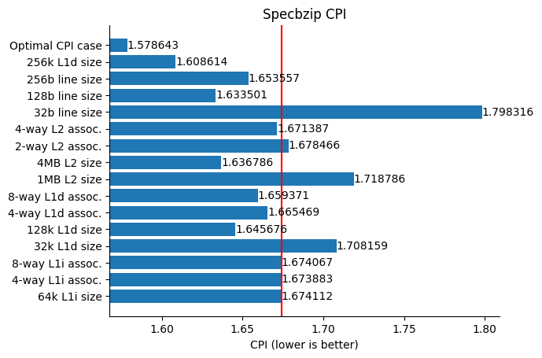
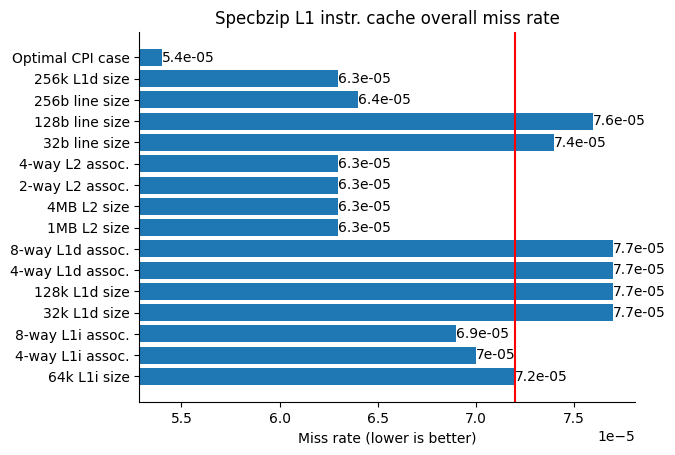
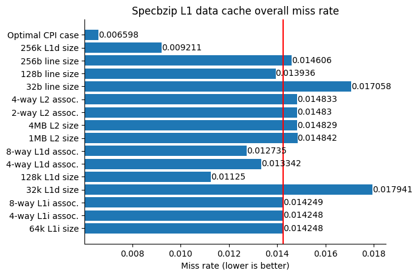
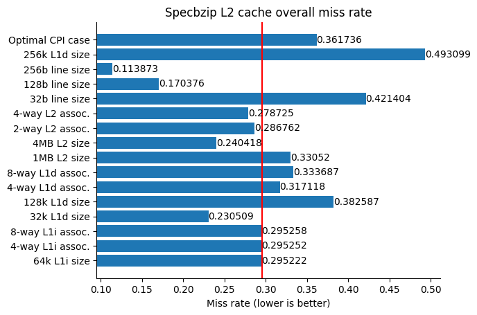

## spechmmer
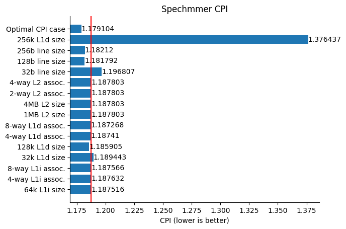

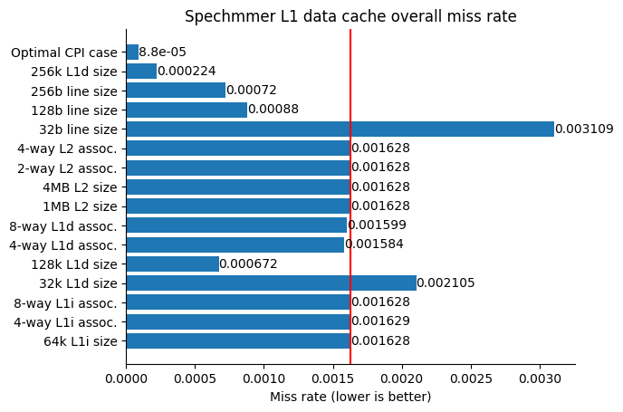
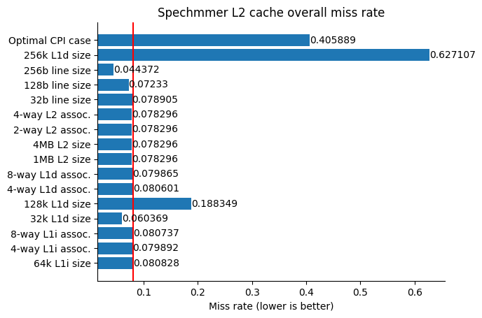

## speclibm
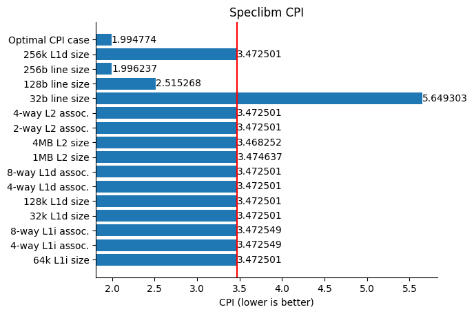
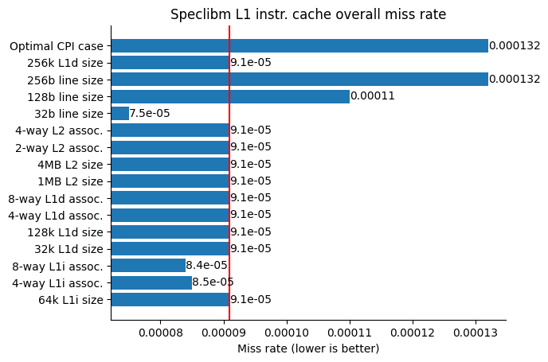
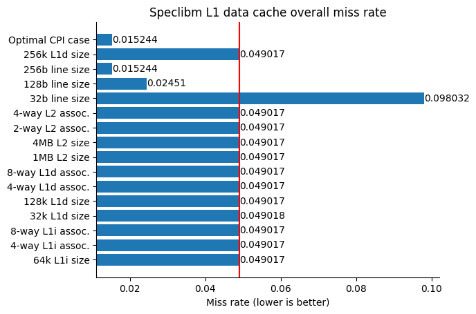

## specmcf
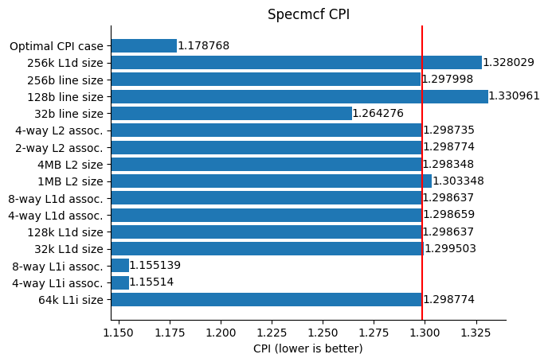
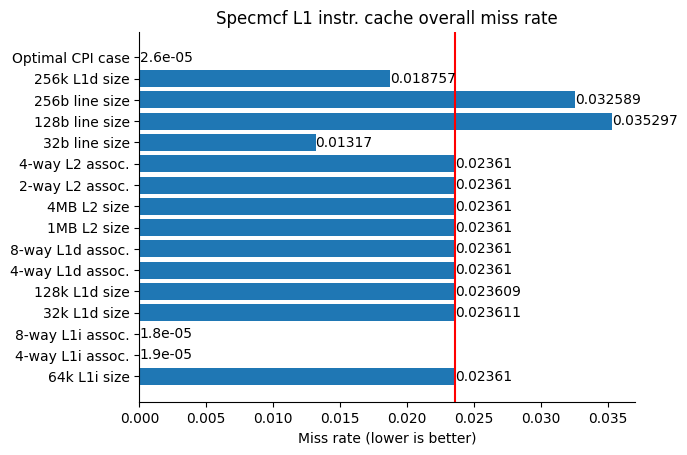
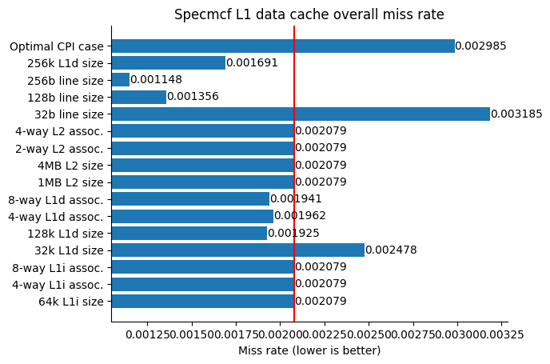
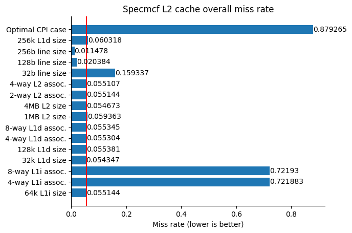

## specsjeng
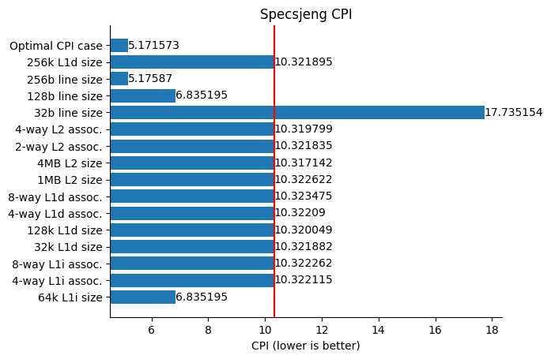
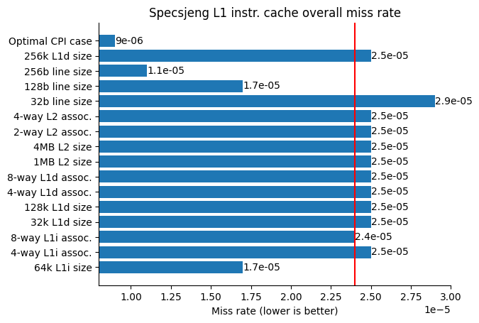
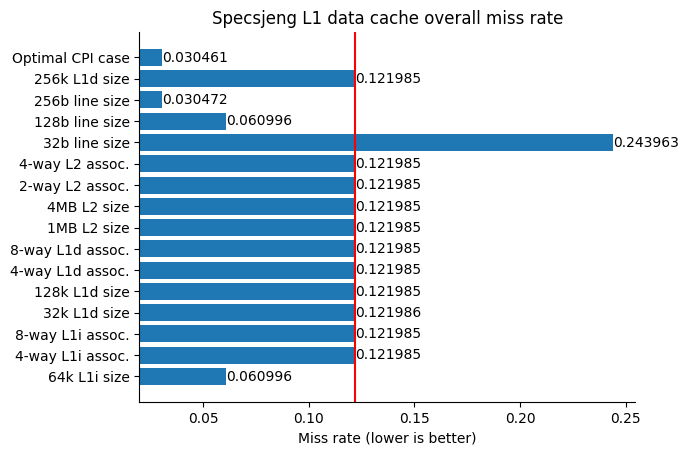
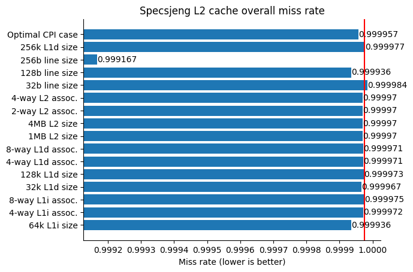

## Απάντηση ερώτησης 1

Στο βήμα αυτό επιλέξαμε να κάνουμε 16 διαφορετικές δοκιμές για κάθε benchmark και σε καθε
δοκιμή αλλάζαμε μια τιμή μόνο από τις default. Αρχικά αλλάξαμε το μέγεθος της L1
instruction σε 64kB. Στην 2η και 3η δοκιμή, αυξήσαμε το associativity της L1 instruction
σε 4 και 8 αντίστοιχα. Οι δοκιμές 4,5 και 15 αφορούν το size της L1 data και οι τιμές
είναι αντίστοιχα 32kB, 128kB και 256kB. Στην 6η και 7η δοκιμή, αυξήσαμε το associativity
της L1 data σε 4 και 8 αντίστοιχα. Οι δοκιμές 8 και 9 έχουν να κάνουν με το size της L2
με τιμές 1MB και 4MB αντίστοιχα. Το default associativity της L2 είναι 8, οπότε στις
δοκιμές 10 και 11 το μειώσαμε σε 2way και 4way. Τέλος στις δοκιμές 12, 13 και 14 το 
μέγεθος που αλλάξαμε ήταν το cache line size σε 32b, 128b και 256b. Μετά από έρευνα και
δοκιμές σε κάθε benchmark προέκυψαν κάποιες τιμές που ελαχιστοποιούν το cpi και αυτή ειναι
η 16η και τελευταία δοκιμή. Η 16η δοκιμή σε κάθε benchmark φαίνεται στη συνέχεια:

| Benchmark | L1 instruction size | L1 instruction associativity | L1 data size | L1 data associativity | L2 size | L2 associativity | Cache Line Size |
|:---------:|:-------------------:|:----------------------------:|:------------:|:---------------------:|:-------:|:----------------:|:---------------:|
|    bzip   |         32kB        |               4              |     256kB    |           8           |   4MB   |         4        |       128       |
|   hmmer   |         32kB        |               2              |     256kB    |           8           |   2MB   |         8        |       128       |
|    libm   |         32kB        |               2              |     64kB     |           2           |   4MB   |         8        |       256       |
|    mcf    |         32kB        |               8              |     128kB    |           8           |   4MB   |         4        |        32       |
|   sjeng   |         64kB        |               4              |     128kB    |           4           |   4MB   |         4        |       256       |

## Απάντηση ερώτησης 2

Στο `specbzip`  παρατηρούμε βελτίωση έως 7% στο CPI, 35.3% στο L1 data miss rate, 12.5%
στο L1 instruction miss rate και 61.4% στη L2 miss rate. Επίσης παρατηρείτε αυξηση έως
67% του miss rate της L2. Αυτά τα αποτελέσματα είναι αναμενόμενα καθώς το `specbzip`
είναι ένα πρόγραμμα συμπίεσης, διαδικασία που σχετίζεται άμεσα με την μνήμη αλλά και
με τον επεξεργαστή.

Στο `spechmmer` παρατηρούμε μικτά αποτελέσματα. Μπορεί το CPI να μειώνεται λίγο, αλλά
το L1 data miss rate μειώνεται έως 86%. Αντιθέτως, τα L1 instruction και L2 miss rate,
έχουν αύξηση έως 427% και 675% αντίστοιχα. Το `spechmmer` χρησιμοποιείται για την
ανάλυση αλληλουχιών και χρησιμοποείται κυρίως στον τομέα της βιολογίας. Η αναζήτηση
σε μεγάλο όγκο δεδομένων σχετίζεται άμεσα με την μνήμη και γι αυτό παρατηρούμε τόσο
μεγάλες αυξήσεις στο miss rate όταν αλλάζουμε το size της L1 data και του cache line.

Στο `speclibm`  παρατηρούμε βελτίωση του CPI έως 42.5%,του L1 data miss rate κατά 68.9%.
Στο L2 miss rate δεν παρατηρούνται αξιοσημείωτες αλλαγές ενώ στο L1 instruction miss
rate υπάρχει αύξηση έως 45%. Το `speclibm` είναι η βιβλιοθήκη που χρησιμοποιείται στη
γλώσσα C για τη χρήση μαθηματικών συναρτήσεων. Όπως γίνεται εύκολα αντιληπτό, οι
μαθηματικές διεργασίες απαιτούν υψηλή δύναμη του επεξεργαστή αλλά και μνήμη. 

Στο `specmcf`  υπάρχει μια βελτίωση έως 11% του CPI, 44.8% του L1 data miss rate και
99.9% στο miss rate της L1 instruction. Αντιθέτως το miss rate της L2 δίνει μείωση έως
79% αλλά και αύξηση έως 1209%. Το `specmcf` είναι ένα πρόγραμμα που ελέγχει την κίνηση
οχημάτων μέσα σε μια πόλη. Αυτό το τεράστιο ποσοστό αύξησης στο miss rate της L2,
οφείλεται στο πολύ μικρό ποσοστό miss rate της L1 instruction.

Στο`specsjeng` παρατηρούμε βελτίωση του CPI έως 49%, του L1 data miss rate έως 75%, του
miss rate της L1 instruction έως 64%. Στο miss rate της L2 δεν παρατηρούνται σημαντικές
αλλαγές. Το πρόγραμμα αυτό είναι μια μηχανή σκακιού. Η μεγαλύτερη αλλαγή εμφανίζεται με
την αλλαγή του cache line size και αυτό είναι απολύτως λογικό, καθώς όλοι οι υπολογισμοί
των κινήσεων και των δεδομένων γίνονται πολύ γρηγορότερα.

# Βήμα 3
## Συνάρτηση κόστους
Για το κόστος της κάθε επιλογής λαμβάνουμε υπόψη το άθροισμα του χρηματικού κόστους
κάθε επιλογής και της πολυπλοκότητάς της.
Έχοντας κατά νου να δώσουμε μια κατά το δυνατόν ρεαλιστική εικόνα του κόστους κάθε επιλογής,
συλλέξαμε δεδομένα από κατά το δυνατόν ρεαλιστικές πηγές και καταλήξαμε στην εξής συνάρτηση κόστους:

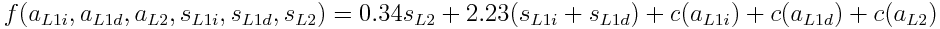

όπου c: 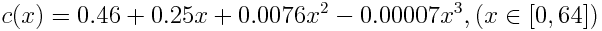

και:
- a_L1i associativity της L1 instruction cache
- a_L1d associativity της L1 data cache
- a_L2 associativity της L2 cache
- s_L1i μέγεθος της L1 instruction cache σε KB
- s_L1d μέγεθος της L1 data cache σε KB
- s_L2 μέγεθος της L2 cache σε KB

## Θεωρήσεις - Παραδοχές
Για το χρηματικό κόστος θεωρούμε πως οι L1 και L2 caches υλοποιούνται συχνά στους
επεξεργαστές σαν SRAM.[1] Επομένως, αναζητήσαμε τις τιμές SRAM modules τα οποία διατίθενται
στην αγορά (από τα καταστήματα Mouser και Arrow Electronics) τα οποία πρόσφεραν χρόνους
πρόσβασης περίπου στην ίδια τάξη μεγέθους με αυτούς σε έναν πραγματικό επεξεργαστή.
Θεωρήθηκαν οι εξής χρόνοι πρόσβασης:

- L1 cache: 1 nsec
- L2 cache: 5 nsec

Η εξέλιξη τιμής προς μέγεθος θεωρηθηκε γραμμική και οι συντελεστές προέκυψαν από best fit
μερικών τιμών.

Όσον αφορά την πολυπλοκότητα που αυξάνει το associativity, η οποία δίνεται από το
πολυώνυμο c(x), ως πρόχειρο μέτρο της θεωρήθηκε η καταναλισκόμενη ενέργεια ανά
ανάγνωση σε μια cache σταθερού μεγέθους (128 KB) και block size (64 byte) και μεταβαλλόμενου
associativity εκφρασμένη ως πολλαπλάσιο της ελάχιστης ενέργειας (αυτής σε 2-way).
Ο λόγος που θεωρήθηκε η καταναλισκόμενη ενέργεια ως μέτρο πολυπλοκότητας είναι η αύξηση
του αριθμού των τρανζίστορ που απαιτούνται για να υλοποιηθεί π.χ. ο απαιτούμενος πολυπλέκτης
για μεγαλύτερο associativity, για κάποιο σταθερό process size. Η συνάρτηση
c δεν είναι παρά μια best-fit καμπύλη πάνω στις μετρήσεις αυτές.
Τα δεδομένα κατανάλωσης ενέργειας ελήφθησαν από προσομοίωση με το πρόγραμμα CACTI
που αναφέρεται στο βιβλίο, στο κεφάλαιο 2.2 της αγγλικής έκδοσης και
μπορούν να βρεθούν στο φάκελο `cost-function`.

ΣΗΜΕΙΩΣΗ:
Η συνάρτηση κόστους δεν λαμβάνει υπόψη της το μήκος γραμμής της cache, καθώς δεν μπορέσαμε
να βρούμε δεδομένα κόστους ή έστω πολυπλοκότητας για να μοντελοποιηθεί. Επομένως, ο πίνακας
των trade-off δεν συμπεριλαμβάνει τις επιλογές με μήκος γραμμής διάφορο των 64 bytes. 

## Κοστολόγηση πιθανών συνδυασμών

Τα κόστη των συνδυασμών που περιγράφονται παραπάνω φαίνονται στον ακόλουθο πίνακα:

| L1 inst. cache size (KB) | L1 data cache size (KB) | L2 cache size (KB) | L1 inst. cache assoc. | L1 data cache assoc. | L2 cache assoc. |   Score   |
|:------------------------:|:-----------------------:|:------------------:|:---------------------:|:--------------------:|:---------------:|:---------:|
|            32            |            64           |        2000        |           2           |           2          |        8        |  898.9702 |
|            64            |            64           |        2000        |           2           |           2          |        8        |  970.3302 |
|            32            |            64           |        2000        |           4           |           2          |        8        |  899.5575 |
|            32            |            64           |        2000        |           8           |           2          |        8        |  900.8909 |
|            32            |            32           |        2000        |           2           |           2          |        8        |  827.6102 |
|            32            |           128           |        2000        |           2           |           2          |        8        | 1041.6902 |
|            32            |            64           |        2000        |           2           |           4          |        8        |  899.5575 |
|            32            |            64           |        2000        |           2           |           8          |        8        |  900.8909 |
|            32            |            64           |        1000        |           2           |           2          |        8        |  558.9702 |
|            32            |            64           |        4000        |           2           |           2          |        8        |  1578.970 |
|            32            |            64           |        2000        |           2           |           2          |        2        |  897.0495 |
|            32            |            64           |        2000        |           2           |           2          |        4        |  897.6368 |
|			 32 		   |		   256 			 |		  2000		  |			  2           |           2          |        8        | 1327.1302 |

## Επιλογή 
Σύμφωνα με τα αποτελέσματα της συνάρτησης κόστους για τα παραπάνω configurations, έχουμε
επιλέξει τα εξής ως βέλτιστα trade-offs ανάμεσα σε χαμηλό CPI και κόστος:

| Benchmark | L1 inst. | L1 data | L2 | L1 inst. assoc | L1 data assoc. | L2 assoc. | Rationale
|:---------:|:--------:|:-------:|:--:|:--------------:|:--------------:|:---------:|:------------------------------------------------------------------------------------------:|
| specbzip  |  32 KB   |  128 KB | 2M |     2-way      |     2-way      |   8-way   | CPI 1.645675. Next best choice (CPI 1.636786) has cost 1578.97 (34% markup)                |
| spechmmer |  32 KB   |  32 KB  | 1M |     2-way      |     2-way      |   8-way   | Minimal changes across the board. Next best CPI (1.185905) costs double (1041)             |
| speclibm  |  32 KB   |  32 KB  | 1M |     2-way      |     2-way      |   8-way   | Dependent on cache line size. Other options are about the same, so we pick the cheaper one |
| specmcf   |  32 KB   |  64 KB  | 2M |     4-way      |     2-way      |   8-way   | Very close to best CPI (0.000001 bigger) yet 1 unit cheaper                                |
| specsjeng |  64 KB   |  64 KB  | 2M |     2-way      |     2-way      |   8-way   | CPI 6.835195 (best). Next best (4M L2) costs 1578.97 units (38% markup)                    |

## Αξιολόγηση εργασίας

Η εργασία αυτή, ήταν με διαφορά μεγαλύτερη από την πρώτη και γι' αυτό πιστεύω θα έπρεπε να
υπάρχει περισσότερος χρόνος απ'ότι στην πρώτη εργασία. Επίσης πιστευω πως θα έπρεπε να είναι
λίγο πιο ξεκάθαρο το μέχρι πότε θα πρέπει να έχουμε έτοιμο το κάθε βήμα, καθώς κάποιες
ερωτήσεις που έγιναν στο εργαστήριο, δεν είχαμε προλάβει να τις ετοιμάσουμε. 

Μου άρεσε όλο το κομμάτι με τα benchmarks και τις συγκρίσεις μεταξύ των διαφόρων τιμών και
έμαθα αρκετά πράγματα. Για το βήμα 3, προσωπικά δυσκολεύτηκα αρκετά, καθώς δεν μπορούσα να
βρω επαρκής πληροφορίες. Ίσως στο pdf θα μπορούσαν να υπάρχουν κάποιες επιπλέον
κατευθυντήριες γραμμές γι αυτό το βήμα.

Παρόλο το μεγάλο χρόνο η εργασία μου άρεσε, αλλά νομίζω χρειάζεται κάποιες βοήθειες (σε χρόνο
και/ή σε hints) για να γίνει ακόμα καλύτερη.

*-Παναγιώτης Σαββίδης*

Σε γενικές γραμμές με καλύπτει η αξιολόγηση του Παναγιώτη, δεν έχω να προσθέσω κάτι παραπάνω
που να αξίζει δική του αναφορά.

*-Γρηγόριος Παυλάκης*

[1]: Computer Architecture: A Quantitative Approach (5th ed.), κεφ. 2.3, σ. 97
