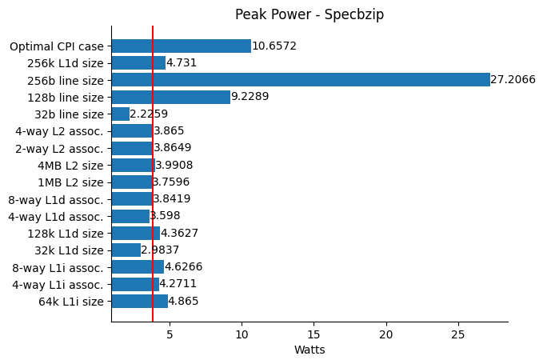
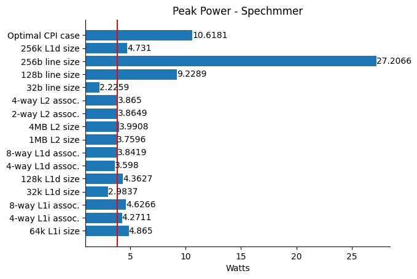
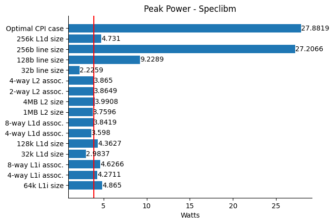
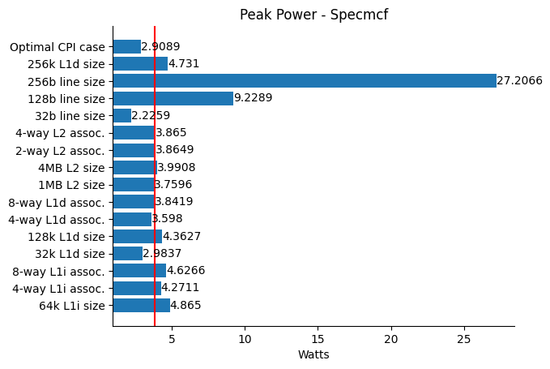
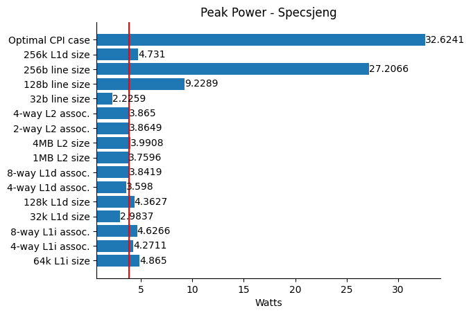

ΑΡΙΣΤΟΤΕΛΕΙΟ ΠΑΝΕΠΙΣΤΗΜΙΟ ΘΕΣΣΑΛΟΝΙΚΗΣ

ΠΟΛΥΤΕΧΝΙΚΗ ΣΧΟΛΗ

ΤΜΗΜΑ ΗΛΕΚΤΡΟΛΟΓΩΝ ΜΗΧΑΝΙΚΩΝ &amp; ΜΗΧΑΝΙΚΩΝ ΥΠΟΛΟΓΙΣΤΩΝ

# Αρχιτεκτονική Προηγμένων Υπολογιστών - 3η Εργαστηριακή Άσκηση

# Βήμα 1
## Απάντηση ερώτησης 1

Ως dynamic power αναφέρεται η ισχύς που καταναλώνεται από το άνοιγμα και κλείσιμο
των transistors, η οποία επηρεάζεται από το πρόγραμμα που τρέχει κάθε φορά, ενώ το
leakage είναι η κατανάλωση της ισχύος που οφείλεται στο ρεύμα διαρροής των
transistor, το οποίο οφείλεται σε φυσικά αίτια και η αντίστοιχη κατανάλωση ισχύος
είναι σταθερή για μια δεδομένη τιμή τάσης τροφοδοσίας (στατική ισχύς). [1]
Με άλλα λόγια, το leakage θα ήταν η τιμή ισχύος του επεξεργαστή αν δεν έτρεχε κανένα
απολύτως πρόγραμμα και ήταν απλά συνδεδεμένος στο ρεύμα. Αυτό που επηράζει το
leakage είναι τα ίδια τα transistors, συγκεκριμένα η τάση τροφοδοσίας και το μέγεθος τους.

Για διαφορετικά προγράμματα στον ίδιο επεξεργαστή, το μέγεθος που θα επηρεαστεί
είναι το dynamic power και εξαρτάται από το πόσα και ποια μέρη του επεξεργαστή
θα χρησιμοποιηθούν, ανάλογα με τις απαιτήσεις του εκάστοτε προγράμματος.

Ο χρόνος εκτέλεσης κάθε προγράμματος δεν επηρεάζει το dynamic power, το
οποίο εξαρτάται αποκλειστικά από τη χωρητικότητα της πύλης των transistor, την
τάση της πηγής και τη συχνότητα αλλαγής (switching frequency) [2]. Ο χρόνος
εκτέλεσης επηρεάζει μόνο τη συνολική κατανάλωση **ενέργειας** σε Joule. Προφανώς,
μεγαλύτερος χρόνος εκτέλεσης σημαίνει περισσότερη κατανάλωση **ενέργειας**, όχι όμως ισχύος.

## Απάντηση ερώτησης 2

Η διάρκεια της μπαταρίας, δηλαδή η συνολική κατανάλωση ενέργειας, επηρεάζεται από
τα static power (leakage), dynamic power και τον χρόνο εκτέλεσης. Αν ο πρώτος επεξεργαστής
που καταναλώνει 4W, καταναλώνει 2W σε dynamic και 2W σε leakage, ενώ ο δεύτερος, των
40 W, καταναλώνει 39.9W σε dynamic και 0.1W σε leakage, τότε αν ο δεύτερος τρέχει πιο
γρήγορα, είναι πιθανό να έχει μεγαλύτερη διάρκεια μπαταρίας. Συνεπώς, μπορούμε να
συνάγουμε το συμπέρασμα οτι τα δεδομένα που μας δίνει ο mcpat, δεν είναι αρκετά
για να υπολογίσουμε τη συνολική κατανάλωση ενέργειας, καθώς χρειαζόμαστε τον χρόνο
εκτέλεσης του προγράμματος. Σε αυτό μπορούν να βοηθήσουν προσομοιωτές όπως ο gem5,
αν τον τρέξουμε παράλληλα με τον mcpat, για το ίδιο πρόγραμμα.

## Απάντηση ερώτησης 3

Το συνολικό leakage power του Xeon είναι 100 φορές μεγαλύτερο από το αντίστοιχο του A9,
το οποίο σημαίνει ότι ο Xeon θα καταναλώνει περισσότερη ισχύ σε κατάσταση αδράνειας
από τον A9, εφόσον είναι μόνο 40 φορές πιο γρήγορος. Αυτά ισχύουν, με την υπόθεση ότι
το σύστημα συνεχίζει να τρέχει, μετά την ολοκλήρωση της εκτέλεσης του προγράμματος
(μένει σε κατάσταση αδράνειας).

# Βήμα 2

## Απάντηση ερώτησης 1

## Απάντηση ερώτησης 2 - Γραφήματα peak power

Η μέγιστη (peak) ισχύς για κάθε περίπτωση απεικονίζεται στα παρακάτω διαγράμματα,
χωρισμένη ανά benchmark. Η κόκκινη γραμμή δείχνει την ισχύ που καταγράφηκε για την
περίπτωση του `MinorCPU` χωρίς καμία μεταβολή στα χαρακτηριστικά του (2GHz clock,
32kB 2-way L1 inst. cache, 64kB 2-way L1 data cache, 2MB 8-way L2 cache,
64 byte cache line).
### specbzip

### spechmmer

### speclibm

### specmcf

### specsjeng

## Πιθανές αιτίες σφαλμάτων

Ο McPAT δεν κάνει πλήρη προσομοίωση των κυκλωμάτων του επεξεργαστή σε επίπεδο
transistor όπως θα έκανε κάποιος προσομοιωτής mixed-signal (πχ. το SPICE). Μια
πλήρης προσομοίωση όμως με κάποιο εργαλείο όπως το SPICE ναι μεν θα έδινε πολύ
ακριβέστερα αποτελέσματα (ο McPAT έχει απόκλιση 10-20% από τις πραγματικές τιμές
των ζητούμενων metrics, [3] σελ.6-7) αλλά μπορεί να δώσει τιμές πολύ πιο γρήγορα.
Μια ακόμα πιθανή πηγή σφαλμάτων είναι και ο gem5, καθώς κάνει από προεπιλογή μόνο
syscall emulation, αγνοώντας τυχόν καθυστερήσεις οφειλόμενες στο υλικό και ως εκ
τούτου μπορεί να παρουσιάζει λάθη στο χρόνο εκτέλεσης.
Μάλιστα, το μοντέλο `TimingSimpleCPU` μπορεί να περιορίσει ως ένα βαθμό τα λάθη,
καθώς λαμβάνει υπόψη του το timing του υλικού. Ο συνδυασμός των δύο προγραμμάτων
πολλαπλασιάζει τα σφάλματα στις παραγόμενες τιμές, αν δεν γίνεται διόρθωση πριν
τον τελικό υπολογισμό.

## Αξιολόγηση εργασίας

*-Παναγιώτης Σαββίδης*

*-Γρηγόριος Παυλάκης*

[1]: https://en.wikipedia.org/wiki/Processor_power_dissipation
[2]: https://web.archive.org/web/20150812030010/http://download.intel.com/design/network/papers/30117401.pd
[3]: https://www.hpl.hp.com/research/mcpat/micro09.pdf